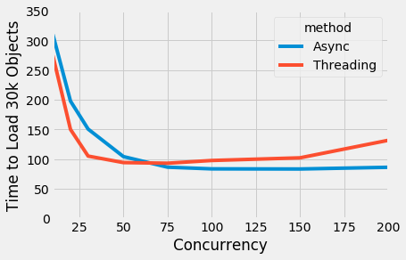
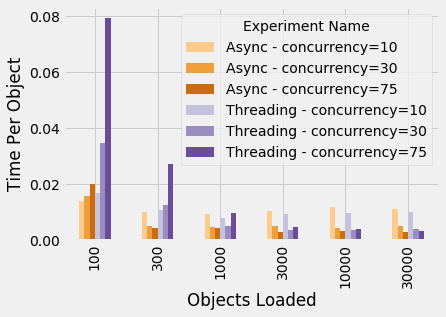

Title: 
**How to Retrieve 100k Objects with Python: Why We Prefer Threading to Asyncio**

A key step in our data pipeline requires loading a few hundred thousand small JSON files from S3. Although Python doesn't have great support for concurrency - thank you, GIL - asynchronous I/O is one context where there are significant benefits. We've experimented with the two obvious methods for asynchronous I/O: threading and asyncio. Although the "asyncio" name indicates that it's literally designed to solve our problem, we think the threading module is the superior choice. Asyncio does feel "more correct" and has marginally less overhead, but it's also less mature and requires deeper restructuring of code to use.

Let's start off by looking at the core code for each of the two approaches. We use the aiobotocore library to use `asnyc` with Amazon's botocore library - more on that in a moment - while we can code up the threading approach from scratch. If you're interested, you can view all of the code for this post on Github. We've even created a public S3 bucket with 100,000 small text files in case you're interested in running the code yourself. 

```python
import asyncio
from concurrent.futures import ThreadPoolExecutor, as_completed
from queue import Empty, Queue
import threading
import aiobotocore
from aiobotocore.config import AioConfig
import boto3
from time_util import async_timing_val, timing_val

BUCKET = 'public-async-testing'

@async_timing_val
async def retrieve_with_async(loop, keys, concurrency):

    session = aiobotocore.get_session(loop=loop)
    config = AioConfig(max_pool_connections=concurrency)
    async with session.create_client('s3', config=config) as s3_client:

        async def get_and_read(key):
            response = await s3_client.get_object(Bucket=BUCKET, Key=key)
            async with response['Body'] as stream:
                return await stream.read()

        return await asyncio.gather(*[get_and_read(key) for key in keys])

def retrieve_key_worker(key_queue, results):
    # We need one client per thread
    s3_client = None
    while True:
        try:
            key = key_queue.get_nowait()
            s3_client = boto3.session.Session().client('s3') if s3_client is None else s3_client
            results.append(s3_client.get_object(Bucket=BUCKET, Key=key)['Body'].read())
        except Empty:
            break
            
@timing_val
def retrieve_with_thread_executor(keys, num_threads=10):
    results = []
    futures = []
    key_queue = Queue()
    for key in keys:
        key_queue.put(key)
    with ThreadPoolExecutor(max_workers=num_threads) as executor:
        for _ in range(num_threads):
            futures.append(executor.submit(retrieve_key_worker, key_queue, results))
    for f in as_completed(futures):
        if f.exception() is not None:
            print(f.exception())
    assert len(results) == len(keys), f'Only {len(results)} results returned.'
    return results

# Example calls:
keys_to_load = ['sample/1.txt', 'sample/2.txt']
concurrency = 10
loop = asyncio.get_event_loop()
async_result = loop.run_until_complete(retrieve_with_async(loop, keys_to_load, concurrency))
threading_result = retrieve_with_thread_executor(keys_to_load, concurrency)

```

The function that uses async is slightly shorter, but that's mostly because the aiobotocore module hides some of the boilerplate from us.  Assuming you pick an appropriately high value for `concurrency`, both methods can download 30k objects in about a minute and a half,
with asyncio performing slightly faster:



Next, let's look at how performance varies with different numbers of objects to download:



Creating threads has high overhead; about 0.01 seconds to create the thread itself, and a surprising 0.05 seconds to create a boto3 client. (All performance numbers in this article are from my older-than-I'd-like MacBook Pro working over a good quality WiFi connection.) This lead to a huge performance drag when retrieving small numbers of objects. With 100 threads, retrieving 100 objects takes 6 seconds, compared to 1.39 seconds for the async function and 1.70 with a more reasonable 10 threads. We tried to ameliorate this by e.g. deferring client creation until the thread has a key to retrieve, but the real solution (of course) is just to not use one thread per object. In general, using too many threads is a problem. By contrast, setting a high concurrency value for aiobotocore didn't cause any problems for us.

On the other hand, creating threads requires an explicit decision about the degree of concurrency. Aiobotocore defaults to a pool of ten connections, which is too few our use case. (For a while, we mistakenly believed that the default was 100 connections and that aiobotocore was just slower than threading.) Even though libraries like aiobotocore and aiohttp don't require you to explicitly set the level of concurrency, you should still experiment with it.

So if asyncio gives equal or superior performance, why do we prefer threading? 

First, using asyncio with third party code can be a headache. Let's you have a client that you want to use asynchronously (like the boto3 client in our example.) The asyncio library uses the `await` keyword to indicate where a function (or, more accurately, a coroutine) can yield control while it waits for I/O to complete. In the example above, we await `s3_client.get_object()`. However, there's a catch. Only ["awaitables"](https://docs.python.org/3/glossary.html#term-awaitable) can be awaited, and there's no way to convert a normal function into an awaitable. Creating an asyncio-compatible version of a client can mean duplicating code for the *entire* stack of calls in order to convert each function to an `async` coroutine.

Aiobotocore gives a great example of this. The [module](https://github.com/aio-libs/aiobotocore/tree/master/aiobotocore) duplicates many botocore functions and modifies them by adding `async` and `await` keywords. At a glance, it looks like the async version of `get_object` that we used earlier awaits the async `_make_api_call` which awaits the async `_send_request` which awaits the async `_get_response` which awaits the async `_request` and so on. Fortunately the aiobotocore module takes care of all of this for us, but they had to dive deeply into the internals of the botocore module, figure out which functions needed to be modified, and then copy/paste hundreds of lines of code before adding the appropriate keywords. If you want to use a client that doesn't already have an async-version available, you're out of luck.

By contrast, threading can easily be wrapped around synchronous code without much concern for the internals. We had to slightly restructure our code by having workers read from a queue of keys rather than taking a list as an argument, but that's it. (Note that [appending results to a list is thread-safe](https://docs.python.org/3/faq/library.html#what-kinds-of-global-value-mutation-are-thread-safe).) Once we wrap slow I/O calls in threads, we don't need to worry about the entire stack of functions involved in that I/O. Quite simply, threading feels a lot more plug-and-play than using asyncio.

The second reason we prefer threading is that asyncio is still immature. It was only introduced in Python 3.4 and was significantly restructured with the introduction of the `async` keyword in 3.5. New features were introduced in 3.7, like the [create_task](https://docs.python.org/3/library/asyncio-task.html#asyncio.create_task) function. The documentation has also shifted significantly, with  e.g. more emphasis on awaitables in [3.7](https://docs.python.org/3.7/library/asyncio-task.html) than in [3.5](https://docs.python.org/3.5/library/asyncio-eventloop.html). 

For the final reason we prefer threading, we'll refer back to the title of this blog post. When we use the asyncio code to download 100k objects, it doesn't always work:

> botocore.exceptions.ClientError: An error occurred (RequestTimeTooSkewed) when calling the GetObject operation: The difference between the request time and the current time is too large.

Our async code creates all 100k requests at once and then parcels them out over about ten minutes. However, by the time the server receives the last of those requests, enough time has passed that the server raises the RequestTimeTooSkewed error.

Perhaps this shouldn't be held against asyncio more generally. It's an implementation detail of how AWS handles requests, and there's an easy fix (breaking up the 100k requests into smaller batches). But from our perspective, it reflects the major difference between threading asyncio. Threading uses existing code with only minimal alteration. By contrast, asyncio requires users to alter code at a very low level, and that can have unexpected results.

Anyway, as promised, our threading code can download 100k files in 342.51 seconds with 50 threads:

```python
num_threads = 50
keys_to_load = [f'samples/{i}.txt' for i in range(100000)]
thread_result = retrieve_with_thread_executor(keys_to_load, num_threads)
print(f'Successfully loaded 100000 objects in {thread_result[0]} with {num_threads} threads')
```
> Successfully loaded 100000 objects in 342.506783246994 with 50 threads
